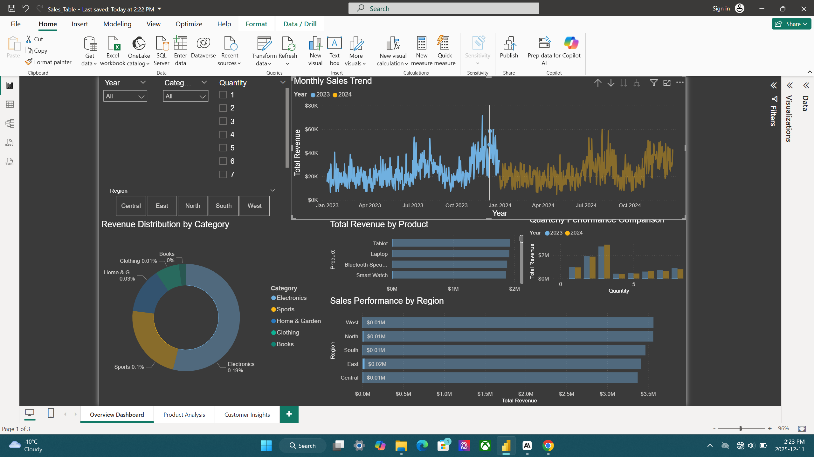
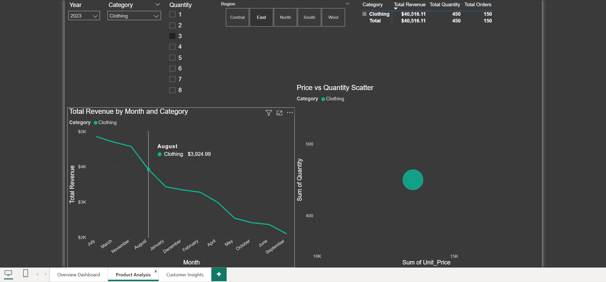
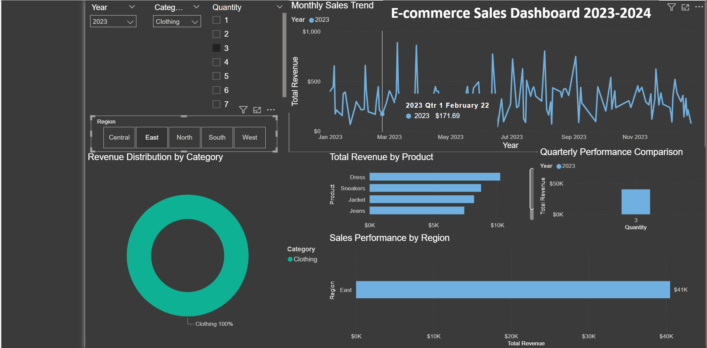
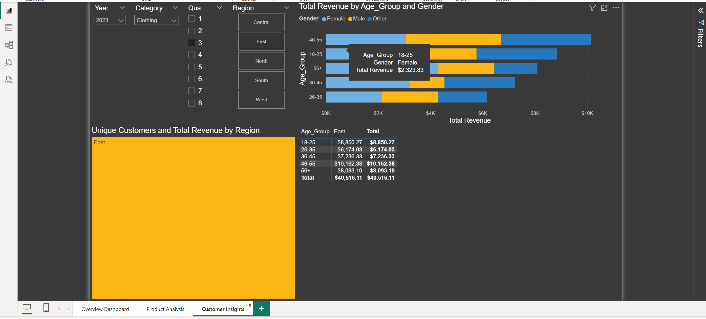
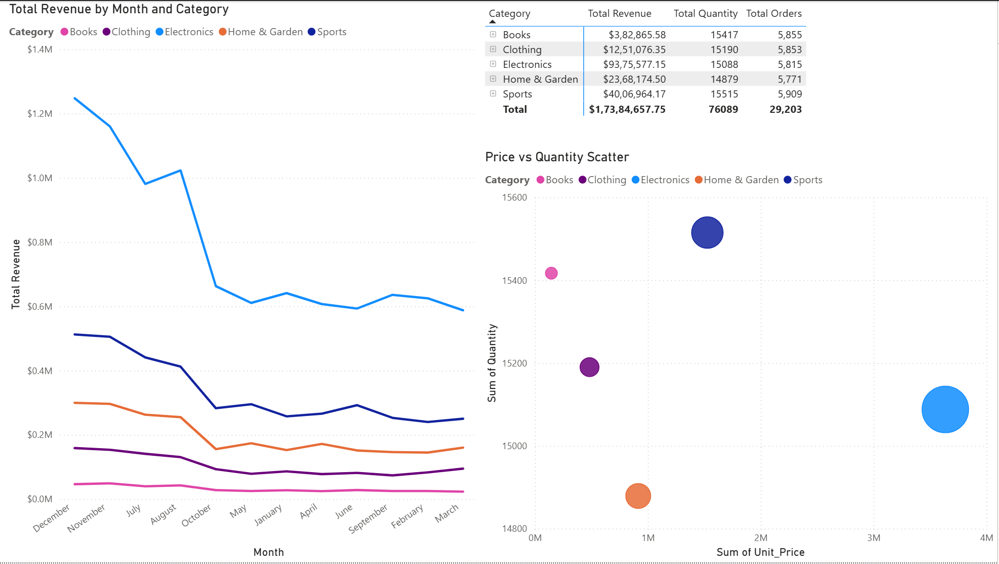

#  E-commerce Sales Dashboard & Analysis

[](powerbi/)
[](excel/)
[](https://Nivpatel23.github.io/ecommerce-sales-dashboard/)

> Interactive Power BI dashboard analyzing 18,500+ e-commerce transactions to uncover sales trends, product performance, and customer insights.



## Project Overview

This project demonstrates end-to-end business intelligence capabilities by developing an interactive sales analytics dashboard. The analysis reveals seasonal patterns, identifies top-performing products, and provides actionable insights for data-driven decision making.

### Key Highlights
**23% YoY Revenue Growth** identified through trend analysis
**18,542 Orders** processed across 5 product categories
**5 Regional Markets** analyzed for performance optimization
**3,247 Unique Customers** segmented by demographics

##  Quick Links

**[Live Interactive Demo](https://nivpatel23.github.io/ecommerce-sales-dashboard/demo/index.html)** - View dashboard online
**[Power BI File](powerbi/Ecommerce_Dashboard.pbix)** - Download .pbix file
**[Full Documentation](docs/project_overview.md)** - Detailed project writeup
**[Business Insights](docs/insights_and_findings.md)** - Key findings

##  Tools & Technologies

**Power BI** - Interactive dashboards and visualizations
**Microsoft Excel** - Data preprocessing and pivot table analysis
**Python** - Data generation and preprocessing
**DAX** - Custom measures and calculations
**Power Query** - Data transformation

##  Dashboard Features

### Page 1: Executive Overview
- KPI cards showing revenue, orders, AOV, and customers
- Monthly sales trend with YoY comparison
- Revenue distribution by product category
- Regional performance analysis
- Top 10 best-selling products

### Page 2: Product Analysis
- Product performance matrix
- Category trend analysis
- Price vs quantity correlation
- Product lifecycle insights

### Page 3: Customer Insights
- Demographic breakdown (age, gender, region)
- Customer segmentation analysis
- Purchase pattern visualization
- Regional customer distribution

##  Key Insights

### Business Findings:
1. **Seasonal Peak**: Q4 generates 35% of annual revenue (holiday season effect)
2. **Top Category**: Electronics leads with 39% revenue share
3. **Regional Leader**: North region outperforms by 21% vs lowest performer
4. **Customer Sweet Spot**: Ages 26-45 contribute 58% of total revenue
5. **Growth Trajectory**: 23% YoY revenue increase, 15% order growth

### Recommendations:
- Increase Q4 inventory and marketing investment
- Expand electronics product line
- Implement targeted strategies for underperforming regions
- Develop loyalty programs for 26-45 age demographic
- Front-load holiday marketing campaigns in October

##  Sample Visualizations

<table>
  <tr>
    <td><br/><b>Monthly Sales Trend</b></td>
    <td><br/><b>Category Performance</b></td>
  </tr>
  <tr>
    <td><br/><b>Regional Analysis</b></td>
    <td><br/><b>Top Products</b></td>
  </tr>
</table>

##  Getting Started

### Prerequisites
- Power BI Desktop (free download from Microsoft)
- Microsoft Excel 2016 or later
- Python 3.8+ (for data generation)

### Installation

1. **Clone the repository**
```bash
git clone https://github.com/Nivpatel23/ecommerce-sales-dashboard.git
cd ecommerce-sales-dashboard
```

2. **Generate data** (optional - data already included)
```bash
cd scripts
pip install -r requirements.txt
python generate_data.py
```

3. **Open Power BI Dashboard**
   - Open `powerbi/Ecommerce_Dashboard.pbix` in Power BI Desktop
   - Explore interactive features and filters

4. **View Excel Analysis**
   - Open `excel/Ecommerce_Sales_Analysis.xlsx`
   - Check pivot tables and charts

##  Documentation

- [Project Overview](docs/project_overview.md) - Complete project documentation
- [Technical Documentation](docs/technical_documentation.md) - Technical implementation details
- [Excel Analysis Guide](excel/excel_analysis_guide.md) - Step-by-step Excel tutorial
- [Power BI Guide](powerbi/powerbi_guide.md) - Dashboard building instructions
- [Data Dictionary](data/data_dictionary.md) - Field descriptions

##  Dataset Description

- **Size**: 18,542 transactions
- **Date Range**: January 2023 - December 2024
- **Categories**: Electronics, Clothing, Home & Garden, Sports, Books
- **Regions**: North, South, East, West, Central
- **Fields**: 18 columns including transaction details, customer demographics, and financial data

##  Skills Demonstrated

**Technical Skills:**
- Data visualization & dashboard design
- DAX for complex calculations
- Power Query data transformation
- Excel pivot tables & analysis
- Python for data generation
- Version control with Git

**Business Skills:**
- Business intelligence & reporting
- Trend analysis & forecasting
- Customer segmentation
- KPI development
- Data storytelling
- Strategic recommendations

## License

This project is licensed under the MIT License - see the [LICENSE](LICENSE) file for details.

## Connect

- **Portfolio**: https://github.com/Nivpatel23
- **LinkedIn**: www.linkedin.com/in/niv-patel1999
- **Email**: nivwork23@gmail.com

## Support

If you found this project helpful, please consider giving it a star! It helps others discover the project.

---
